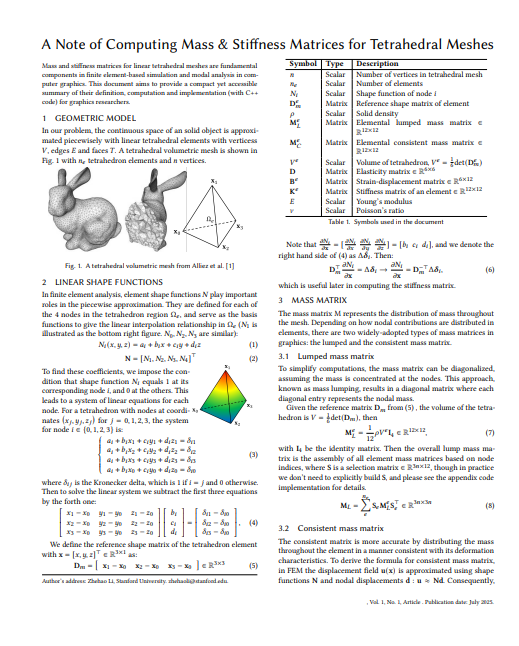

# Simple Modal Sound Synthesizer

>"Everything should be made as simple as possible, but not simpler." --Albert Einstein

### Screenshot 
#### 1. Modalshape visualization


#### 2. Real-time sound playback with interactive face picking


## Features
- [x] Linear elasticity mass & stiffness matrices computation 
- [x] Generalized eigen solver (using Spectra)
- [x] Real-time audio synthesis with 3D interactive GUI
- [ ] Import and export with animation made in Houdini

## Installation
Tested on Ubuntu 24.04 with gcc and Windows 11 with Visual Studio 2022. Should work on Ubuntu 22.04 and MacOS, too. 

1. Clone this repo

2. `git submodule update --init --recursive`

3. Do cmake 
    ```shell
    cmake -B build -S .
    cmake --build build --config Release
    ```

4. Then run [`test_realtime_modal_sound`](./test/modal/test_realtime_modal_sound.cpp) in the `build\Release` folder. You can use `--help` to see available options. For the first-time running, it will create `asset/${obj name}/cache` inside `build` folder, assemble mass & stiffness matrix and solve the generalized eigen value problem. Then next time it will directly use the modal data stored in the cache. 

    example output of running `test_realtime_modal_sound -g plate`: 

    ```shell 
    [Time] computeMandK: 68ms
    [1] Solving eigen problem using Spectra::SymGEigsShiftSolver
    After filtering, 68 eigenvalues remain in range [15791.4, 1.57914e+10]:
    [ 52172920.185655, 52558679.5879568, ...]
    [Time] EigenSolver: 1591ms
    Successfully saved data to cache.
    [ModalMaterial] density: 2700, youngsModulus: 7.2e+10, poissonRatio: 0.19, alpha: 6, beta: 1e-07
    [AudioManager] Successfully initialized playback device: ${YourDevicename}
    ```
    Here is a video recording of live demo (Version: March 17th 2025): [link](https://drive.google.com/file/d/1u8ADB_GXMZn8MrK3iapN_wmteZU7MgcV/view?usp=drive_link)

## Dataset

You can download mesh obj files such as obj for bunny and dragon from [KleinPAT dataset](https://graphics.stanford.edu/projects/kleinpat/kleinpat-dataset/dataset_table.html). 

## Document 
For the computation of mass and stiffness matrix, we have a note that aims to provide a compact yet accessible
summary of theirG definition, computation and implementation (with C++
code in [`./src/Geometry/FEM.cpp`](./src/Geometry/FEM.cpp)) for graphics researchers. Check it out! [Link](https://drive.google.com/file/d/1JzM_aWLMzVz63iIysnp7tVUflATzDCel/view?usp=sharing)

[](https://drive.google.com/file/d/1JzM_aWLMzVz63iIysnp7tVUflATzDCel/view?usp=sharing)


## References
- Changxi & Doug's SIGGRAPH Course Note
- DyRT, James et. al. 
- KlainPAT, Wang et. al.
- WaveBlender, Xue et. al.
